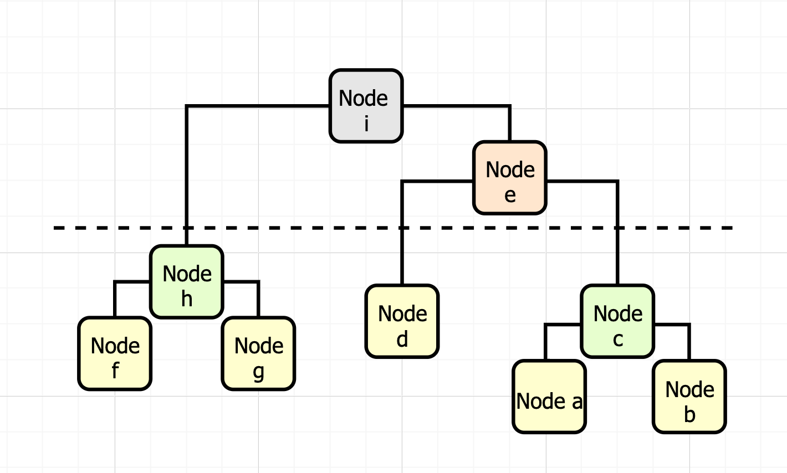

# Hierarchial Clustering (Centroid)
`Hierarchical Clustering` 、 `Closest Pair`

In this homework, you are going to implement a clustering algorithm called `centroid hierarchical clustering algorithm` to hierarchically group N 2-dimensional points in the plane and generate a clustering tree.

In the cluster function, we input the yellow points (a, b, d, f, and g) in Figure 1 and set cluster_num=1 (as demo), you should build a cluster tree as shown in Figure 2, and return the coordinates of the cluster.




Your construction function will receive an list of array (Each array has two elements: x and y). The clustering procedures are described as follows:

* Step 0: Treat each point as a cluster;
* Step 1: Find the nearest pair of clusters `(c1, c2)` among the remaining K clusters (initially K = N, the number of points in the list)
* Step 2: Create a new cluster, `c3`, of which the coordinates are the centroid of all the points it contains after merging the clusters c1 and c2;
* Step 3: Delete the two old clusters: c1 and c2;
* Step 4: K = K - 1;
* Step 5: Re-calculate the distance of the new cluster, c3, to the other remaining clusters;
* Step 6: go to Step 1 until K = cluster_num

Output the centroids of the remaining cluster_num clusters in the sorted order of `(x,y)` pairs. (Sort the centroids by x in the increasing order. If x is equal, sort by y in the increasing order)

## Template
```java
class Cluster {
    public List<double[]> cluster(List<int[]> points, int cluster_num) {
        ArrayList<Point2D> p = new ArrayList<Point2D>();
        for(int[] i: points) {
            p.add(new Point2D(i[0], i[1]));
        }

        ArrayList<double[]> ans = new ArrayList<double[]>();
        ans.add(new double[]{0, 1.5});
        ans.add(new double[]{3, 1.5});
        return ans;
    }

    public static void main(String[] args) {
        List<double[]> out = new Cluster().cluster(new ArrayList<int[]>(){{
            add(new int[]{0,1});
            add(new int[]{0,2});
            add(new int[]{3,1});
            add(new int[]{3,2});
        }}, 2);
        for(double[] o: out)
            System.out.println(Arrays.toString(o));

    }
}
```

## Test Case
**Time Limit: 300ms**

* `0 <= x,y <= M`, x and y are integers.
* We guarantee the coordinates are `unique`
N is the number of points
* We check your answer by `abs(output - answer) <= 1e-3`
* `2 <= cluster_num <= 5`

**Cases**

* case1: 20 points: N <= 10, M <= 20
* case2: 20 points: N <= 500, M < 1000000
* case3: 20 points: N <= 100, M <= 100
* case4: 20 points: N <= 400, M <= 1000
* case5: 20 points: N <= 700, M <= 10000